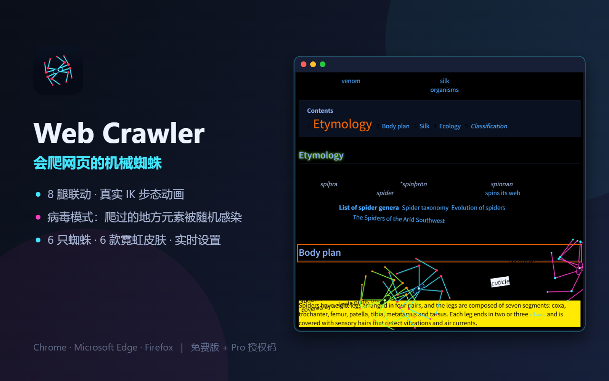

# Web Crawler — 会爬网页的机械蜘蛛（浏览器扩展）

复刻 Slava Rybin 的 "Web Crawler" 蜘蛛视频效果：8 腿真实 IK 步态的霓虹机械蜘蛛
在任意网页上爬行，可选"病毒模式"对页面元素做限时视觉污染并自动还原。
MV3、零依赖、可上架 Chrome / Edge / Firefox，内置买断制授权码付费链路。



## 功能

- **真实步态引擎**（`src/content/engine.js`）：8 腿对角交替步态、两骨 IK
  （膝朝外）、足尖固定文档坐标、超伸/塌缩触发迈步、丝线拖尾、自动跟滚
- **病毒模式**（`src/content/inject.js`）：元素级限时感染——色块/字距/旋转/
  放大/下划线等 12 种突变，保存原内联样式并到期还原，支持半径扩散
- **多蜘蛛 + 6 款皮肤**，free/pro 分层限制写在 `src/common/config.js`
- **合成音效**（`src/content/audio.js`）：落脚哒哒、感染电音、进场 blip，
  Web Audio 现场合成零音频文件；popup/options 可开关 + 音量条，
  关闭即挂起 AudioContext（省电、绝对安静）
- **popup / options 全套 UI**，zh_CN 默认 + en，`_locales` 国际化
- **授权码付费**：`src/common/licensing.js`（扩展侧）+ `server/license-server.js`
  （服务端参考实现），买断/限时/5 设备限额/错码保护均已测试
- **一键打包三商店**：`node tools/build.js` → 产物 + 各商店 zip + 上架前自检

## 目录

```
manifest.json            MV3 清单（permissions 仅 storage）
src/
  background.js          service worker：徽标、启动重验
  common/config.js       默认值/皮肤/分层/TIERS/LICENSING（付费配置在这）
  common/licensing.js    授权码 verify/activate/reverify/deactivate
  content/engine.js      蜘蛛动画引擎（canvas 覆盖层）
  content/audio.js       音效合成（Web Audio，落脚/感染/出生，可开关）
  content/inject.js      生命周期 + 病毒感染/还原 + storage 监听
  popup/  options/       设置界面
_locales/zh_CN|en/       界面文案
icons/                   16/32/48/128 PNG（tools/make-icons.js 生成）
server/license-server.js 授权服务器（纯 Node，零依赖）
tools/
  build.js               自检 + 三商店打包（--check 只检查不产出）
  preview.html           动画预览台（__step/__snapNow/__pageShot/__promo）
  uipreview.html         popup/options 渲染台（含 i18n 键校验）
  serve.js               本地预览服务（含帧导出端点）
  make-icons.js          纯 Node PNG 图标生成
store/
  privacy-policy.md      隐私政策（中英，部署后填 URL）
  chrome-listing.md      Chrome 商店上架文案
  edge-listing.md        Edge 商店上架文案
  review-notes.md        审核备注（中英，直接粘贴）
  monetization.md        付费上线完整指南
  screenshots/           1280×800 商店宣传图
dist/                    构建产物与 zip
```

## 快速开始

```bash
# 1. 自检 + 打包（Chrome / Edge / Firefox 三个 zip）
node tools/build.js
node tools/build.js --check     # 只检查

# 2. 本地预览动画（含病毒模式合成截图）
node tools/serve.js 8941
#   打开 http://127.0.0.1:8941/tools/preview.html
#   控制台：__step(300) 推进 | __pageShot('x') 整页截图 | __promo({...}) 宣传图

# 3. 渲染 popup / options（校验 i18n 键）
#   打开 http://127.0.0.1:8941/tools/uipreview.html
#   控制台：__ui('popup').then(i => __uiShot('ui_popup'))   __ui('options')...

# 4. 授权服务器
LICENSE_ADMIN_SECRET='<强随机串>' node server/license-server.js 8787
node server/license-server.js create lifetime     # 本地发一张终身码
```

开发授权码（仅 `devKeys: true` 时）：`WC-DEV-PRO`、`WC-DEV-TEST`。

## 手动加载扩展

- Chrome/Edge：`chrome://extensions` → 开发者模式 → 加载已解压 → 选 `dist/chrome`
- Firefox：`about:debugging` → 临时载入 → 选 `dist/firefox/manifest.json`

## 上架流程（详见 store/ 下文档）

1. `store/privacy-policy.md` 部署成公开 HTTPS 页面，拿到 URL
2. `node tools/build.js` 生成三个 zip
3. Chrome：devconsole 上传 chrome zip（$5），文案抄 `store/chrome-listing.md`，
   审核备注抄 `store/review-notes.md`，隐私 URL 填第 1 步
4. Edge：partner dashboard 上传 edge zip（免费），权限说明抄 `store/edge-listing.md`
5. Firefox：addons.mozilla.org 上传 firefox zip
6. 过审后按 `store/monetization.md` 接入收款 + 填 `LICENSING.endpoint/buyUrl`

## 付费配置

`src/common/config.js`：

```js
LICENSING.endpoint = 'https://lic.example.com'   // 授权服务器
LICENSING.buyUrl   = 'https://buy.example.com'   // 收款页（Stripe Payment Link 等）
```

改完重新 `node tools/build.js`。分层能力改 `TIERS` 即可，扩展端自动生效。

## 设计约束（审核相关）

- 无远程代码：不含 eval / new Function / 远程脚本，`build.js` 扫描强制
- 覆盖层 `pointer-events: none`，不拦截页面交互
- 病毒模式只改 inline style 并保存原值，到期还原；不增删 DOM 节点
- 权限仅 `storage`；页面内容绝不读取、不上传
- 免费版永久可用，付费只走站外 + 授权码

## 灵感来源

视觉效果灵感来自 Slava Rybin (@rybinfx) 的 "Web Crawler" 视频
（https://x.com/rybinfx/status/2105700296760688790）。本项目代码为独立实现。
